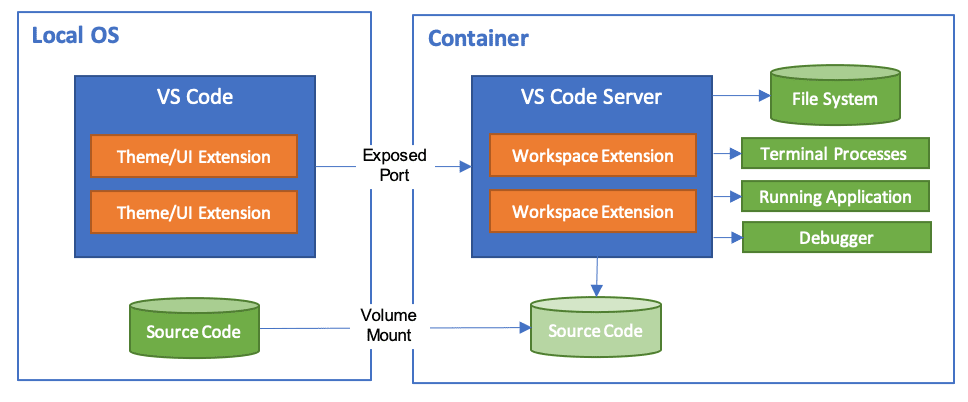

このミニマムセットアップは、devcontainer 内からホストの Docker を使って `docker compose up` を実行し、ワークスペースの `frontend` と `backend` がコンテナへ正しくマウントされることを確認するための例です。

前提
- VS Code で Remote - Containers / Dev Containers を使用してこのリポジトリを開いていること。
- `devcontainer.json` に `remoteEnv` で `LOCAL_WORKSPACE_FOLDER` が設定されていること（このリポジトリでは既に設定済み）。
- Devcontainer の Dockerfile が `/var/run/docker.sock` バインドを許可していること（`docker-compose.devcontainer.yml` でマウント指定済み）。

使い方（devcontainer の中で実行）:

```bash
# コンテナ内のシェルで
docker compose -p project2 -f /workspace/docker-compose.yml up -d

# 起動済みコンテナの確認
docker ps

# マウント確認：sample_test_service に入って /workspace を見る
docker exec -it sample_test_service_01 sh
ls -la /workspace
ls -la /workspace/frontend
ls -la /workspace/backend
```

終了:

```bash
docker compose -p project2 -f /workspace/docker-compose.yml down
```

注意: Windows 上の Docker Desktop を使う場合、`LOCAL_WORKSPACE_FOLDER` はホストのパスになるため、コンテナ内で`docker compose` を実行すると、ホストパスがマウント先として利用されます。パスの形式に注意してください。
asd


